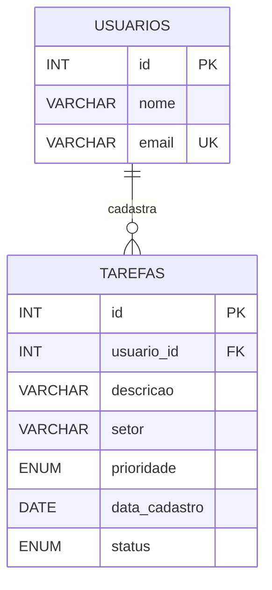
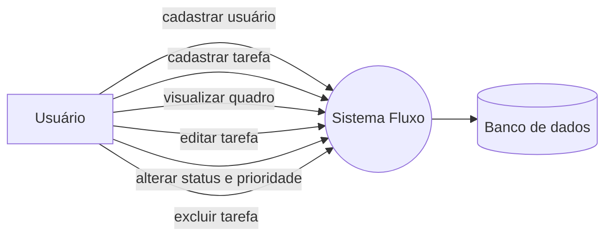

# Entregáveis de modelagem

## Diagrama entidade-relacionamento

## Caso de uso: gerenciamento de tarefas

Os diagramas podem ser exportados para JPG ou PNG usando qualquer renderizador Mermaid compatível.
